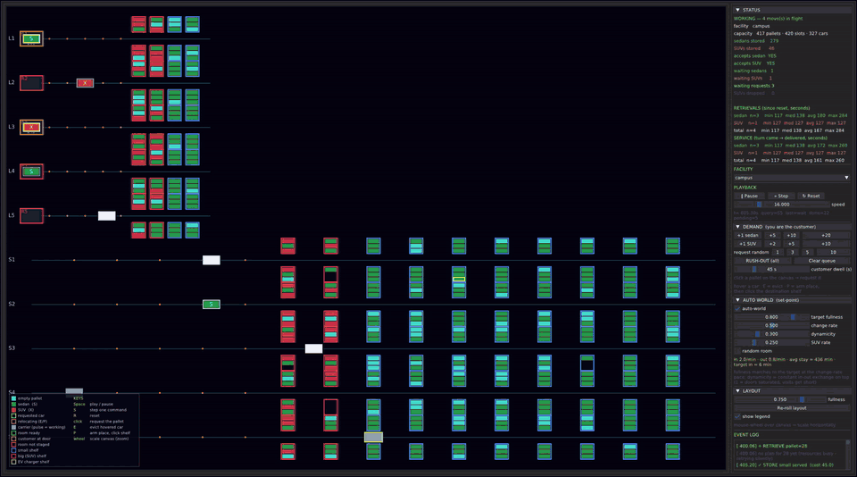
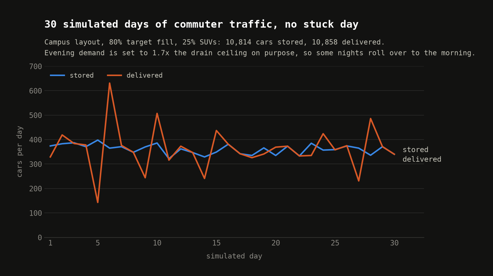
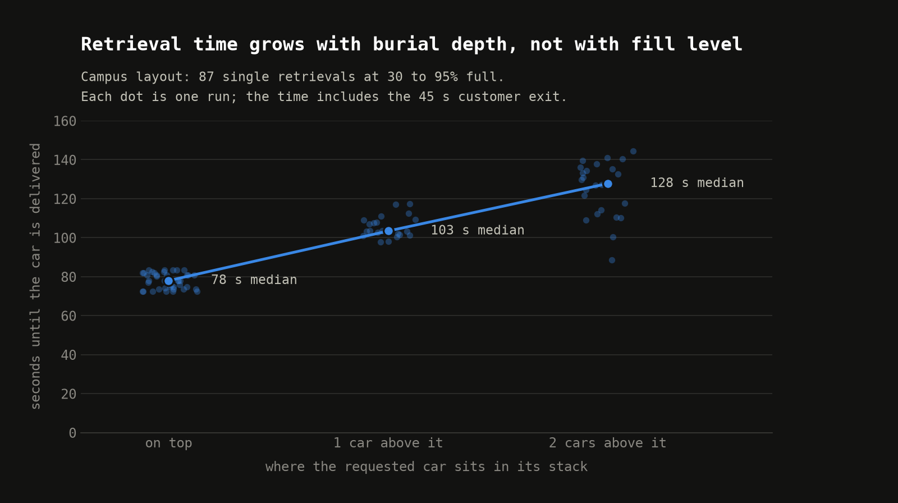
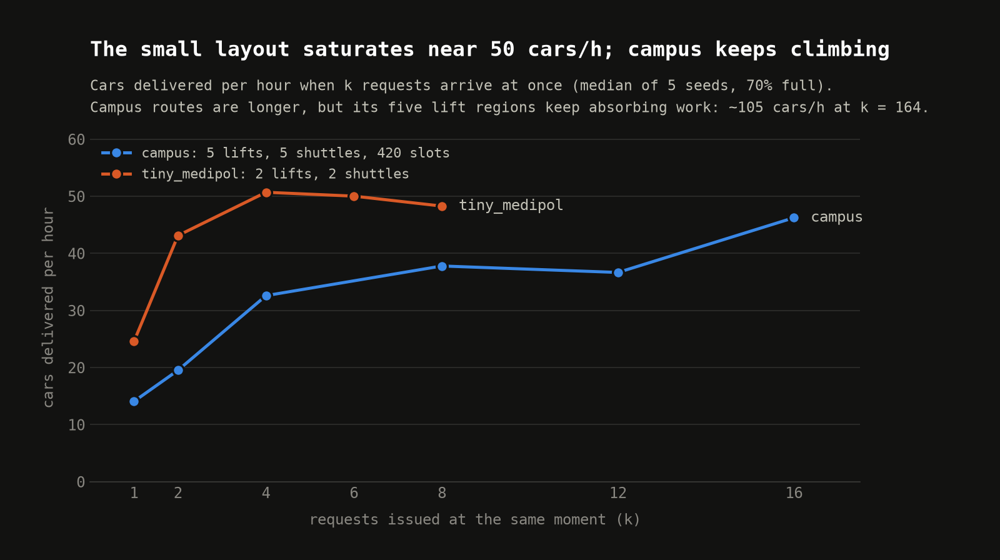

# OOSSolver

A discrete-event **simulator** and a **deterministic plan solver** for an **OOS
automated car park** — a facility where carriers (lifts and shuttles) move
pallet-borne cars between LIFO shelves and customer rooms. The system and its
dynamics are specified in [`docs/PROBLEM.md`](docs/PROBLEM.md).

**Control is solved by the V3 plan solver** (no learning anywhere in the
system): `oos/plan/planner.py` + `oos/plan/solver.py` + `oos/plan/runtime.py`,
specified by [`docs/SOLUTION_V3.md`](docs/SOLUTION_V3.md) with the behavior
contract in [`docs/AGENT_BEHAVIOR.md`](docs/AGENT_BEHAVIOR.md). A
tutorial-style walkthrough of the algorithm — what it is, how the oracle,
planner, solver, and executor fit together, with a traced example — is in
[`docs/HOW_THE_SOLVER_WORKS.md`](docs/HOW_THE_SOLVER_WORKS.md). Its acceptance
battery runs with `python -m oos.plan.battery --gate all`. An earlier RL
training pipeline was removed once the solver passed the full battery; it
survives in git history and in the docs under `docs/`.

[](docs/media/oossolver-demo.mp4)

The visualiser running the `campus` layout (5 lifts, 5 shuttles, 420 slots) at
16x speed, with the set-point world sending cars in and asking for them back
and the V3 solver planning every move.
[Watch the full 75-second recording](docs/media/oossolver-demo.mp4).

## Results

Every run uses deterministic seeds, so each number reproduces exactly. The
full write-ups, with every experiment and the defects the long runs exposed,
are the characterization reports for [`campus`](reports/campus/report.md)
and [`tiny_medipol`](reports/tiny_medipol/report.md).

- **Acceptance battery: 7 of 7 gates pass.** The deepest car on a full
  `dibaji` (100 of 100 seeds), the deepest SUV at 85% full, fill-then-dig
  through the solver, a 164-car mass drain on `campus`, a full day cycle,
  seven consecutive days without a reset, and dig and drain batteries on
  every registered layout.
- **30 simulated days** of commuter traffic on `campus`: 10,814 cars stored,
  10,858 delivered, 0 stuck days, every car out by the end of the month, in
  about 21 minutes of wall time.
- **72 tests** in `tests/`.







The charts are drawn from the reports' data by
[`reports/make_readme_charts.py`](reports/make_readme_charts.py).

## The system

An OOS facility stores and retrieves cars (sedans and SUVs), each riding on a
fungible pallet, across a network of independently-moving carriers that hand off to
one another and to LIFO shelves; cars enter and leave only at customer rooms.
Layouts range from a single carrier with one room up to many rooms with multiple
serving and non-serving carriers. The full description — entities, state, the
`GOTO` / `TAKE` / `GIVE` / `WAIT` primitives, automatic handoffs, customer
load/unload, and concurrency — is in [`docs/PROBLEM.md`](docs/PROBLEM.md).

## Code structure

| Part | Module | Responsibility |
|------|--------|----------------|
| **SimEngine** | `oos/sim/facility.py` | The discrete-event world: topology, state, scheduler, task queue, dynamics, `advance_until`. |
| **Plan solver** | `oos/plan/` | The control brain: `oracle.py` (solvability/admission oracle), `planner.py` (retrieval planning), `solver.py` (plan + rung dispatch), `runtime.py` (headless pump loop), `battery.py` (acceptance battery). |
| **Move layer** | `oos/plan/moves.py` | Pallet-move primitives (`Move`, `MoveExecutor`): compiles a move into carrier scripts and executes them against the live engine. |
| **Environment** | `oos/env/env.py` | The per-carrier decision loop over one SimEngine: action enumeration/decoding (`oos/env/action.py`), `advance_until` / `submit_action` / `needs_decision`. Used by the viz to drive the sim frame by frame. |
| **Viz** | `oos/viz/` | Interactive DearPyGui visualizer: `Session` (headless logic) + `SolverBridge` (solver ↔ decision loop) + `app` (rendering glue). |

## Repository layout

```
oos/
├── sim/         discrete-event SimEngine (state, scheduler, queue, dynamics, motion)
├── plan/        the deterministic V3 plan solver: oracle, planner, solver, runtime, battery,
│                and the pallet-move executor (moves.py)
├── env/         decision-loop Environment + action enumeration (drives the sim for the viz)
├── viz/         interactive DearPyGui visualizer / driver (solver-driven)
├── facilities/  hand-authored facility registry (name -> factory)
├── dsl/         facility-definition builder DSL (authors + validates topologies)
└── config/      experiment-config dataclasses (durations, task stream)

tests/           pytest suite: smoke, kinematics, primitives, shuffle, plan solver, viz
docs/            PROBLEM.md — the system spec; SOLUTION_V3.md — the solver spec;
                 AGENT_BEHAVIOR.md — the behavior contract; earlier docs are history
```

## Getting started

Uses **uv**; requires **Python ≥ 3.12**.

```bash
uv sync
```

### Tests

```bash
uv run python -m pytest tests/ -q
```

### Acceptance battery

The solver's full acceptance battery (retrieval gates, continuous operation,
full-state conformance):

```bash
uv run python -m oos.plan.battery --gate all
```

### Visualizer

```bash
uv run python -m oos.viz [facility]
```

Opens a DearPyGui app: a canvas renders the live facility (carrier tracks, shelves,
room docks, the customer queue) beside a sidebar to play / pause / step, randomize
state, tune a set-point auto-world, queue customer interactions by hand, and click
pallets to request a car. The V3 plan solver drives the carriers. With no
positional facility it reopens the last-used one (or `tiny_medipol`).

## Facilities

Ten facilities are registered (look up via `get_facility(name)`):

`mini` · `tiny` · `tiny_tall` · `tiny_wide` · `tiny_medipol` · `stacker` ·
`stacker_deep` · `stacker_wide` · `dibaji` · `campus`

New facilities are authored with the `oos.dsl` builder, which validates and
compiles a topology to a frozen `(Topology, SeedingConfig)`:

```python
from oos.dsl import Carrier, Facility, Handoff, Room, Shelf

def make_facility():
    fac = Facility("example")
    fac.register_carriers(...)   # carriers, their tracks, shelves, rooms
    fac.pair(...)                # declare handoff poses between carriers
    fac.seed_pool()              # seed initial empty pallets
    return fac.build()           # -> (Topology, SeedingConfig)
```
